<div align="center">

<h3><code>arnav@github ~ $ ./contributions.sh</code></h3>


<br><br>

<h3><code>arnav@github ~ $ whoami</code></h3>

<table>
<tr>
<td valign="top">

</td>
<td valign="top">

</td>
</tr>
</table>

</div>

---

### `arnav@github ~ $ cat about.txt`

Bioengineering student at IIT Jodhpur focused on computer science, artificial intelligence, and machine learning. I build software from scratch, with particular interest in ML systems and practical developer tools.

### `arnav@github ~ $ cat stack.txt`

```text
languages   C++ · Python · Node.js · SQL
data / ml   NumPy · Pandas · scikit-learn · PyTorch · TensorFlow · Hugging Face
tooling     Git / GitHub · Linux
```

### `arnav@github ~ $ ls projects/`

- [**DESMOS Engine**](https://github.com/b25bb1004-wq/DESMOS_engine) — Lightweight C++ mathematical expression parser/evaluator and function plotter, with tokenization, implicit multiplication, Shunting-Yard conversion, postfix/RPN evaluation, mathematical functions, and ASCII plotting.
- [**F1 Pitstop Strategy**](https://github.com/b25bb1004-wq/F1-Pitstop_Strategy) — Machine-learning and data-analysis work using FastF1 data to model tyre degradation and investigate pit-stop strategy.
- [**Spaghettify**](https://github.com/b25bb1004-wq/spaghettify) — Electron/WebGL productivity tool that uses a black-hole-style visual effect as a stretch and break reminder.

### `arnav@github ~ $ contact`

- GitHub — [b25bb1004-wq](https://github.com/b25bb1004-wq)
- IIT Jodhpur — [b25bb1004@iitj.ac.in](mailto:b25bb1004@iitj.ac.in)
- Personal — [arnavyadav3008@gmail.com](mailto:arnavyadav3008@gmail.com)
- Portfolio — coming soon

<div align="center">
<code>build → test → learn → repeat</code>
</div>
