<div align="center">

# `arnav@github`

**CS • AI • ML**

*Bioengineering @ IIT Jodhpur — building software because that's where I keep ending up.*

<br>



<br><br>

<code>arnav@github ~ $ whoami</code>

<br><br>

<table>
<tr>
<td valign="top">

</td>
<td valign="top">

</td>
</tr>
</table>

</div>

---

### `arnav@github ~ $ cat interests.txt`

```text
computer science
artificial intelligence
machine learning
software engineering
building things that actually run
```

### `arnav@github ~ $ cat stack.txt`

**Languages**  
`C++` `Python` `SQL`

**AI / ML**  
`PyTorch` `TensorFlow` `scikit-learn` `Hugging Face` `NumPy` `Pandas`

**Development**  
`Node.js` `Linux` `Git / GitHub`

### `arnav@github ~ $ ls projects/`

| Project | What it is |
|---|---|
| **[DESMOS Engine](https://github.com/hades-3008/DESMOS_engine)** | C++ mathematical expression parser, evaluator and function plotter |
| **[F1 Pitstop Strategy](https://github.com/hades-3008/F1-Pitstop_Strategy)** | ML experimentation on F1 tyre degradation and lap-time prediction |
| **[Spaghettify](https://github.com/hades-3008/spaghettify)** | Electron/WebGL desktop productivity overlay with real-time screen lensing |
| **[StudyHub](https://github.com/hades-3008/StudyHub)** | Collaborative learning platform |
| **[UNIVERSE](https://github.com/hades-3008/UNIVERSE)** | Experimental project / application |

### `arnav@github ~ $ contact`

- **Personal:** [arnavyadav3008@gmail.com](mailto:arnavyadav3008@gmail.com)
- **IIT Jodhpur:** [b25bb1004@iitj.ac.in](mailto:b25bb1004@iitj.ac.in)
- **GitHub:** [hades-3008](https://github.com/hades-3008)

> Portfolio coming soon.

<br>

<div align="center">
<code>build → break → learn → repeat</code>
</div>
